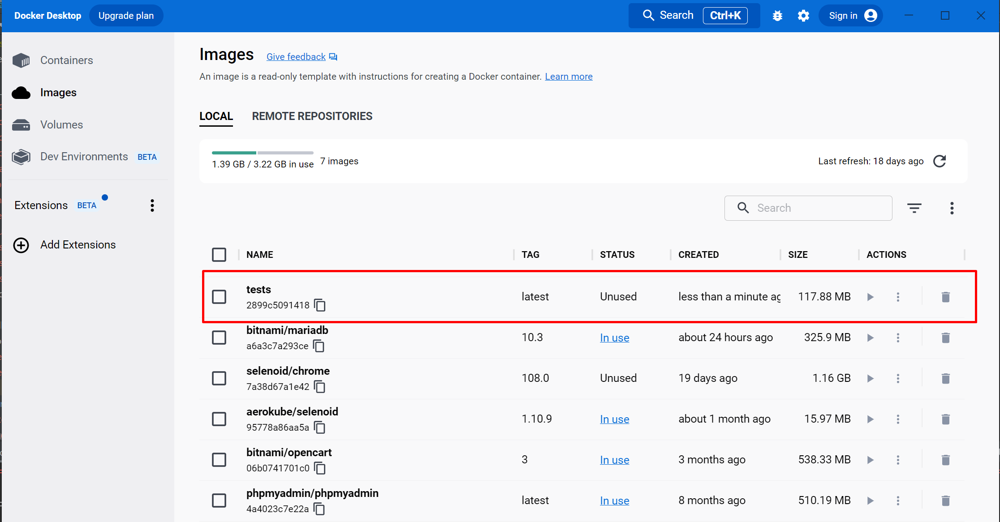
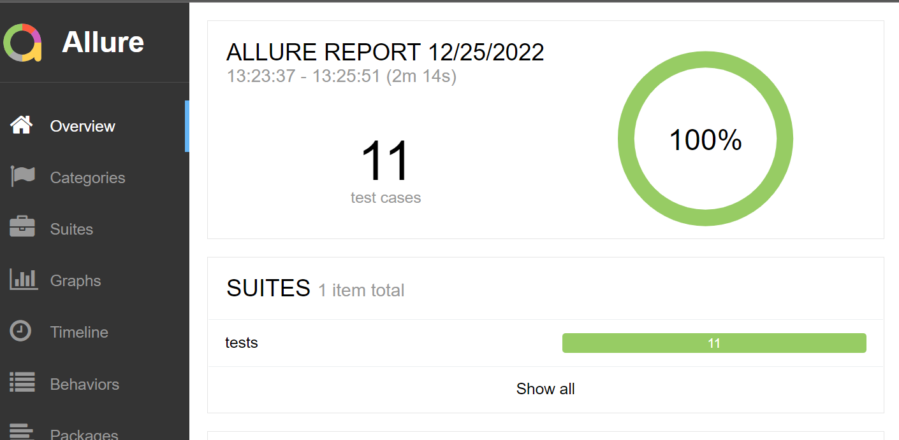
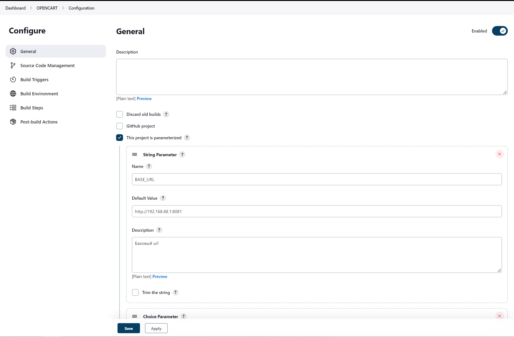
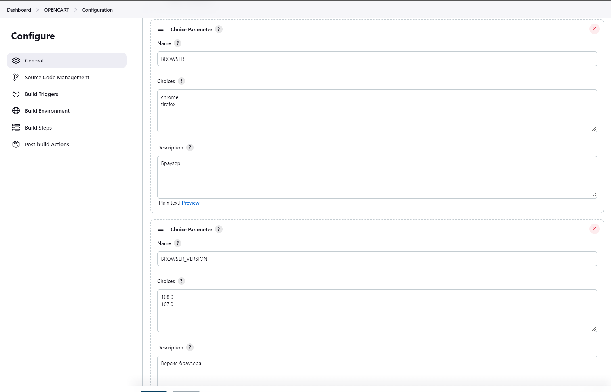
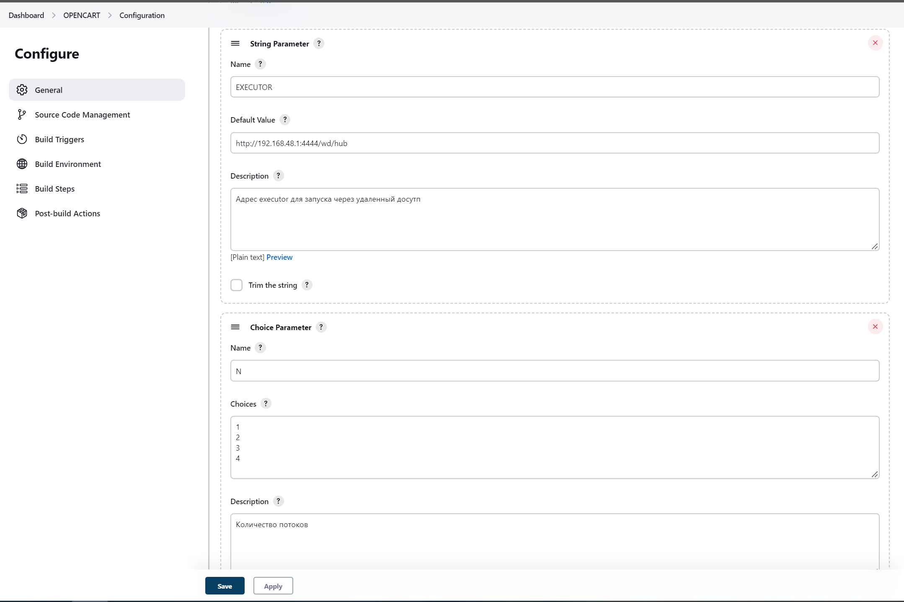
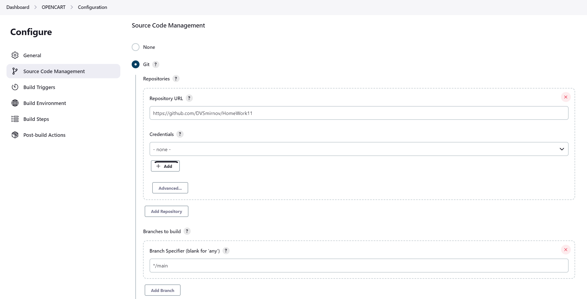
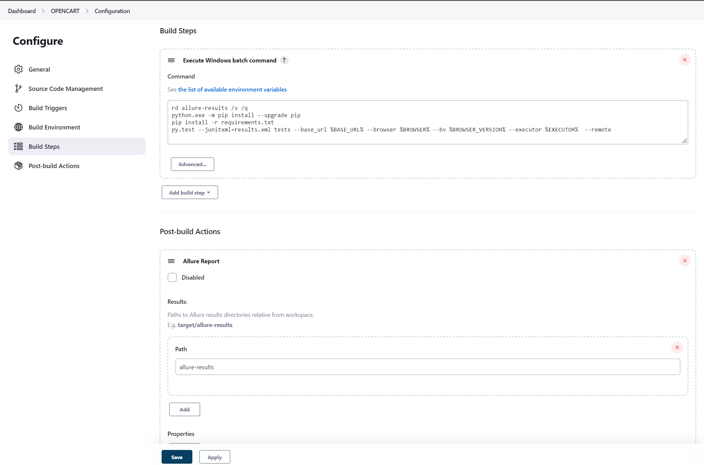
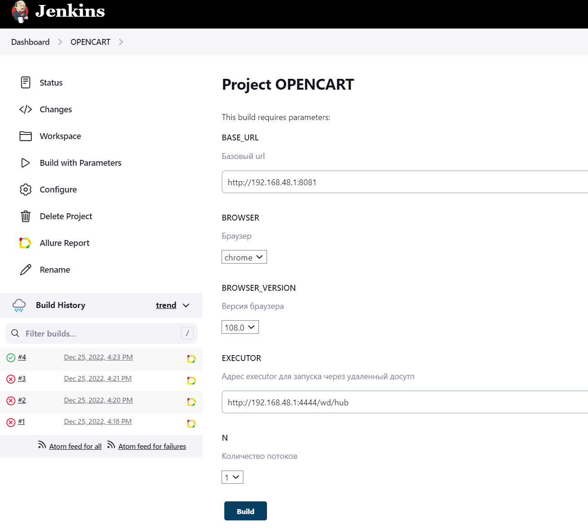
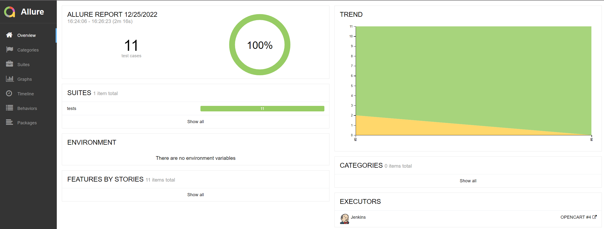

### ЗАПУСК ТЕСТОВ ЧЕРЕЗ DOCKERFILE
1. Запустить opencart, selenoid, selenoid-ui, загрузить браузеры с помощью команды "docker pull _browser_settings_". На ПК должен быть установлен allure
2. В директории проекта выполнить "docker build -t tests ."
   * В десктопном приложении docker появится образ (image) с тестами: 
   
3. Запуск контейнера с тестами с генерацией отчета: "docker run --name tests_run tests:latest && docker cp tests_run:/app/allure-results . && allure serve allure-results"

### JENKINS
#### Настройки джобы:

#### Запуск джобы:

#### Сгенерированный отчет:

